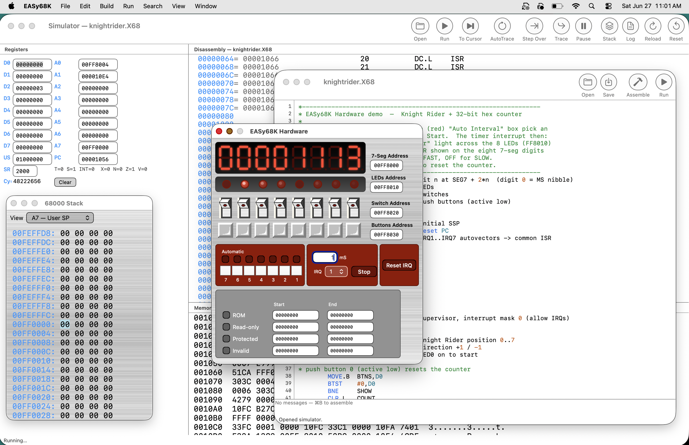
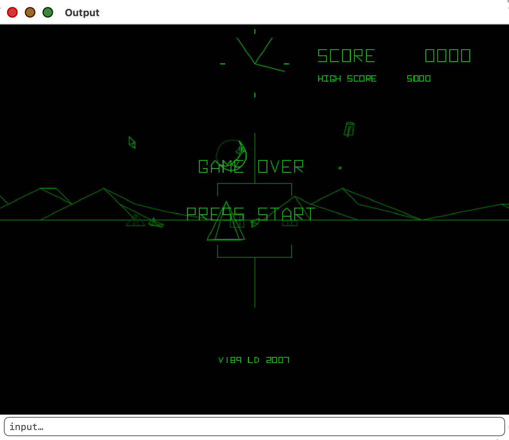

# EASy68K for macOS

A native **macOS** port of [EASy68K](http://www.easy68k.com/) — the Motorola
68000 editor, assembler and simulator originally written by Chuck Kelly for
Windows. The original Borland C++ Builder / VCL application has been rebuilt as a
**C99 core** (assembler + CPU/simulator) driven by a hand-written **Cocoa**
front end. The goal was a true **1:1 feature-complete** conversion — every
window, dialog, menu and TRAP.



> ⚠️ **NOT FOR COMMERCIAL USE.** Copyright © 2026 mikewolak@gmail.com,
> Epromfoundry, Inc. Licensed for **personal and educational use only**.
> Commercial use, sale, or distribution for profit is strictly prohibited
> without prior written permission. The original EASy68K is © Chuck Kelly.

---

## Highlights

- **Pure C99 assembler + simulator core** — the 68000 instruction set, the
  assembler (incl. structured statements, macros, `INCLUDE`), and the simulator
  ported from the Windows sources and audited for 32→64-bit pitfalls.
- **Native Cocoa UI** — editor, simulator, and every child window rebuilt with
  AppKit; Core Graphics rendering, `CVDisplayLink` 60 FPS, retina-crisp.
- **Pro audio / MIDI / serial / networking** — low-latency CoreAudio, CoreMIDI
  with hot-plug, termios serial with USB hot-plug, and BSD-socket TCP/UDP —
  all selectable and persisted in a Settings panel.
- **A localhost remote-control API** for scripting and automated testing.

---

## 32-bit → 64-bit port

The original EASy68K is a 32-bit Windows application; building it as a modern
64-bit macOS binary surfaced a class of latent bugs that the original 32-bit
build never hit, and fixing them took a careful audit of the whole core:

- **Pointer-width assumptions.** The CPU core discriminated *register vs. memory*
  operands by comparing raw pointer values across the `D[]`/`A[]`/`memory[]`
  arrays — fine when pointers were 32 bits, but under 64-bit clang the array
  layout and reordering broke it. Reworked to test against the `memory[]` block
  bounds with `uintptr_t` ranges (a 6-agent parallel audit of `put()`/`value_of()`
  and the instruction decoders, since fixing one-offs wasn't safe).
- **Format-string width mismatches.** `%lX`/`%08lX` fed `int32_t` arguments
  (right on a 32-bit `long`, wrong on a 64-bit `long`) corrupted the execution
  log and memory dumps — corrected throughout.
- **Reset / initial-state bugs.** `OLD_PC` and related state had to be primed
  exactly so the first relative branch resolved correctly.
- Plus the CRLF line-ending and `INCLUDE`-path fixes in the assembler that any
  Windows-authored source would otherwise trip over.

The result is a clean C99 core that produces byte-identical assembly and matches
the original simulator's behaviour.

---

## Editor

- 68000 assembly **syntax highlighting**, multiple documents, line numbers.
- Native **Find / Replace** bar (`⌘F`, `⌘G`, `⇧⌘G`, `⌥⌘F`).
- **Assemble** (`⌘B`) and **Assemble & Run** (`⌘R`) straight into the simulator.
- **Page Setup / Print** the source; **Font…** picker (mono family + size,
  persisted) applied to source, registers and memory views; `⌘+`/`⌘−`/`⌘0`.

## Assembler

- Full 68000 instruction set and addressing modes, S-record (`.S68`) + listing
  (`.L68`) output.
- **Structured statements** — `IF/ELSE/ENDI`, `WHILE/ENDW`, `REPEAT/UNTIL`,
  `FOR/ENDF`, `DBLOOP`, with `<eq> <ne> <lt> <ge> <hi> <mi> …` conditions and
  `and`/`or` compounds.
- **Macros**, `INCLUDE` (resolved relative to the source file), and the full
  directive set.
- **CRLF-safe** — Windows-authored `.X68` files assemble identically to Unix
  ones (a stray `\r` used to corrupt the last token on a line).

## Simulator

- **Editable register panel** — `D0–D7`, `A0–A7`, `US`, `PC`, `SR` as live hex
  fields you can type into; **SR flag breakdown** (`T S INT X N Z V C`); a
  **cycle counter** with **Clear**.
- **Run menu** — Run, **Step Over**, **Trace Into**, **Run To Cursor**,
  **Auto Trace** (+ options dialog: interval & disable-display), Pause, Reset,
  Reload.
- **Search menu** — **Find in Memory** (hex sequence or `"`ASCII), **Goto PC**.
- **Standalone Memory windows** (open several) — hex/ASCII dump, address jump,
  **Row/Page spinners** + wheel scroll, `From/To/Bytes` range with
  **Copy / Fill / Save**, and a **Live** checkbox that follows execution.
- **Breakpoints** window, **68000 Stack** window, source-level **.L68 listing**
  with PC highlight + breakpoint gutter, **Execution Log** (with **Save…**),
  **Open Data** (load a binary into memory).
- A separate **I/O window** (graphics canvas + console); closing it halts the
  running program.

## Hardware simulator

A pixel-faithful rebuild of the EASy68K hardware panel (memory-mapped at
`$FF8000`+), rendered with Core Graphics:

- Eight **7-segment displays**, eight **LEDs**, eight bitmap **toggle switches**,
  eight momentary **push buttons** (active-low).
- **Interrupt** section (maroon) — seven IRQ buttons **and** the per-IRQ
  *Automatic* checkboxes; **Auto Interval** timer; **Reset IRQ**.
- **Memory Map** editor — ROM / Read-only / Protected / Invalid regions.
- Matches the original's **colour scheme** (maroon control panels, gray memory
  map) — plus an optional **LED afterglow** (smooth trailing glow, toggle in
  *Settings → Hardware LED glow*).

## EASyBIN — binary / S-record utility

A native port of the standalone **EASyBIN v2.5.0** tool (Window → *EASyBIN —
Binary Utility*), on its own 16 MB buffer:

- **Open** a Motorola S-record or a raw binary (with ÷2/÷4 spread to recombine
  split EPROM dumps).
- **Edit** the buffer in an inline hex view (click a byte, type hex, arrow-key
  navigation).
- **Save Binary** over a First Address + Length range — raw, or with an EPROM
  **even/odd (÷2)** or **quad (÷4)** split that writes `_0`/`_1`(/`_2`/`_3`)
  files for multi-chip sets.
- **Save S-Record** over a From/To range with a start address (S0 description +
  S1/S2/S3 data + S7, fully checksummed).

## Graphics (TRAP #15)

Full canvas: pixel / line / rectangle / ellipse / fill / flood-fill / text /
pen & fill colours / scroll / double-buffering, drawn into a Core Graphics
offscreen bitmap and presented at a strict **60 FPS** via `CVDisplayLink`.
**Full-screen** scales the canvas centred, **preserving exact aspect ratio**
with black letterbox/pillarbox.

The **gravity-wave** demo (`demos/gravityWave/`) is a vsync-locked **60 FPS**
green wireframe of a LIGO-style binary inspiral: two solid bodies spiral inward
and their orbital motion radiates the rippling "gravity-wave" sheet
(`z = 60·cos(2·atan2(y,x) − Θ + 0.544331·r) / (20 + r)`, after this
[Wolfram visualization](https://community.wolfram.com/groups/-/m/t/790989)).
The wave phase is locked to **twice** the orbital phase (the quadrupole *m=2*
relation), it **chirps** toward merger, then rings down — all in hand-written
68000 assembly with the trig / `atan2` / projection baked into lookup tables:


The **EASYZONE** game (a Battlezone-style 68000 vector game) runs end-to-end —
graphics, sound effects and keyboard input:



## Input, Sound, MIDI, Serial, Networking

| Subsystem | Hardware Support |
|---|---|
| **Keyboard / Mouse** | Keyboard input and **`getKeyState`** (task 19) using the original Windows virtual-key codes, plus key/mouse **interrupts** and mouse position/button reporting — so games like EASYZONE play exactly as on the original. |
| **Sound** | Low-latency CoreAudio (`HALOutput` + lock-free SPSC ring buffer). WAVs of *any* rate/bit-depth are resampled with Apple's **mastering-grade SRC**. `SND_NOSTOP` semantics match the original. Output **device + L/R channel** selectable. |
| **MIDI** | CoreMIDI in/out with **hot-plug** detection; device selection persisted; a new **MIDI I/O TRAP** (task 120). |
| **Serial** | Real serial ports via **termios**, **USB hot-plug** via IOKit; port + baud selectable; comm TRAP tasks 40–43. |
| **Networking** | BSD-socket **TCP/UDP** (TRAP tasks 100–107) — client/server, send/receive, hostname resolution. |
| **I/O interrupts** | A new **TRAP task 121** lets a program enable/disable **MIDI and serial RX/TX interrupts** (real 68000 autovector IRQs). Off by default; never affects programs that don't use them. |

All audio/MIDI/serial devices are chosen and remembered in a single **Settings**
window (with hot-plug-aware pickers).

## Remote-control API

EASy68K embeds a small **localhost HTTP server** so the editor, simulator and
EASyBIN utility can be driven and inspected from scripts — this is how the whole
app is verified during development (load a program, run it, read registers and
memory, export a binary, all headless).

### Enabling it

The server is **off by default**. Turn it on one of three ways (it binds to
`127.0.0.1` only):

| How | Example |
|---|---|
| Command-line flag | `open EASy68K.app --args --control-port 8077` |
| Environment variable | `EASY68K_CONTROL_PORT=8077 open EASy68K.app` |
| Default when env set | port **8068** if neither flag nor env overrides it |
| Disable explicitly | `--no-control` (or port `0`) |

All examples below use port `8077`. Parameters may be passed as a **query
string** or in the **POST body**. Read endpoints return `text/plain`; action
endpoints return `application/json`. `GET /` returns the list of endpoints.

### Editor / document

| Method · Endpoint | Purpose |
|---|---|
| `POST /open?path=FILE` | Open a source file in the editor |
| `GET  /source` | Return the front document's source text |
| `POST /source` *(body = text)* | Replace the front document's source |
| `POST /save` | Save the front document |
| `POST /assemble` | Assemble it → `{errorCount, warningCount, …}` |
| `POST /run` | Assemble, open the simulator and run |

### Simulator

| Method · Endpoint | Purpose |
|---|---|
| `GET  /status` *(or `/registers`)* | Machine state (see below) |
| `POST /sim/load?path=FILE.S68` | Load an S-record into the simulator |
| `POST /sim/run` | Free-run |
| `POST /sim/step` | Single step → returns the new state |
| `POST /sim/stop` | Halt the run |
| `POST /sim/reset` | Reset → returns the new state |
| `POST /sim/input?text=STR` | Feed a line to the console (TRAP input) |
| `GET  /memory?addr=HEX&len=N` | Hex/ASCII dump of simulator memory (`len` default 256) |
| `GET  /console` | The I/O console text |

`/status` returns JSON:

```json
{ "D": [d0..d7], "A": [a0..a8], "PC": 4096, "SR": 8192, "cycles": 0,
  "halted": false, "running": true, "loaded": true,
  "program": "knightrider.S68", "status": "Running…" }
```

### EASyBIN (binary / S-record utility)

Operates on EASyBIN's own 16 MB buffer (independent of the simulator). All take
**hex** addresses; `split` is `0`/`2`/`4`.

| Method · Endpoint | Purpose |
|---|---|
| `POST /bin/load-srec?path=FILE` | Load an S-record → `{low, high, start, length, s0}` |
| `POST /bin/load-bin?path=FILE&addr=HEX&split=N` | Load raw binary at `addr` (split spreads bytes) |
| `POST /bin/save-bin?path=FILE&from=HEX&len=HEX&split=N` | Save range as binary; `split 2`→`_0`/`_1`, `4`→`_0`..`_3` |
| `POST /bin/save-srec?path=FILE&from=HEX&to=HEX&start=HEX` | Save range as an S-record |
| `GET  /bin/memory?addr=HEX&len=N` | Hex/ASCII dump of the EASyBIN buffer |

### Example session

```sh
B=http://127.0.0.1:8077
curl -s -X POST "$B/sim/load?path=$PWD/demos/bouncingBall.S68"
curl -s -X POST "$B/sim/run"
curl -s "$B/status" | jq .PC
curl -s "$B/memory?addr=1000&len=64"

# export the loaded program as an EPROM-split binary pair
curl -s -X POST "$B/bin/load-srec?path=$PWD/demos/bouncingBall.S68"
curl -s -X POST "$B/bin/save-bin?path=/tmp/rom.bin&from=1000&len=400&split=2"
#  → /tmp/rom_0.bin (even bytes) + /tmp/rom_1.bin (odd bytes)
```

---

## Building

```sh
make            # builds bin/asm68k, bin/sim68k (CLI) and build/EASy68K.app
make app        # just the macOS app
make test       # core test suite
open build/EASy68K.app
```

Requires the macOS command-line tools (clang). Frameworks linked: Cocoa,
CoreVideo, AVFoundation, AudioToolbox, CoreAudio, CoreMIDI, IOKit.

## Demos

- `games/easyzone/` — the **EASYZONE** vector game (graphics, sound, keyboard).
- `demos/gravityWave/` — animated **gravity-wave** binary inspiral (3D wireframe,
  vsync-locked 60 FPS); `gen.py` bakes the trig / projection into the asm tables.
- `demos/` — `bitmap`, `lineArt`, `bouncingBall`, `land` (graphics + structured
  asm + `INCLUDE`).
- `tests/hw/knightrider.X68` — exercises the hardware panel: a timer-interrupt-
  driven **Knight Rider** sweep across the LEDs and a **32-bit hex counter** on
  the 7-segments; switch 7 selects speed, push button 0 resets.
- `tests/net/`, `tests/serial/` — networking and serial-interrupt test programs.

---

## Credits

- Original **EASy68K** © Chuck Kelly — www.easy68k.com
- macOS port © 2026 **mikewolak@gmail.com**, Epromfoundry, Inc.
- Audio engine modelled on the KickDrumWorkshop low-latency CoreAudio driver.

**NOT FOR COMMERCIAL USE** — personal and educational use only.
